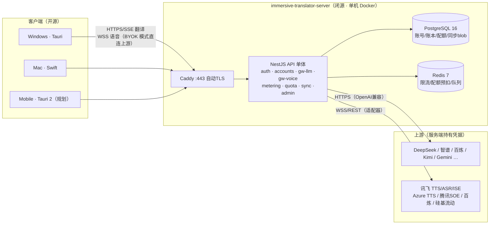

# 服务端技术架构与需求规划 · immersive-translator-server

> 日期：2026-09-22 · 状态：v0.1 · P1/P2/P3 已拍板（服务器**境内**、免费档**默认额度生效**、计费走**兑换码**，详见 §11/§11.1）
> 输入：五个主需求（独立服务端仓库 / 登录账号 / 聚合网关 HTTPS+WSS / 配额计量 / 多端数据同步）
> 依据已拍板的战略：**客户端全开源 + 服务端闭源**、移动端 Tauri 2 中国区首发（`docs/mobile-app-research.md` §0）
> 结论先行：**单体 NestJS + PostgreSQL + Redis，单机 Docker 部署；邮箱注册起步；网关做成「OpenAI 兼容入口 + 语音统一协议 + 上游适配器」；同步做成「实体级 LWW + 服务端不解析内容的 blob 存储」**。理由逐节展开。

---

## 0. 结论速览

| 决策点 | 推荐 | 备选 | 一句话理由 |
|---|---|---|---|
| 仓库 | 独立私有仓库 `immersive-translator-server` | — | 已拍板「客户端开源+服务端闭源」，必须分仓 |
| 形态 | **模块化单体**（一个 NestJS 进程） | 微服务 | 一台服务器、单人开发，单体够用到 1 万级用户 |
| 语言/框架 | **TypeScript + NestJS** | Go（参考 one-api 二开）/ Rust axum | 与客户端 TS 技能复用；横切关注点（鉴权/限流/计量）结构化；类型可与客户端共享 |
| 数据库 | **PostgreSQL 16**（JSONB 存同步 blob） | MySQL | 账本 + JSONB + 事务，一个库全包 |
| 缓存/队列 | **Redis 7**（限流、配额预扣、BullMQ） | MVP 可缓上 | 免费档滥用防护离不开它 |
| 接入层 | **Caddy**（自动 HTTPS） | Nginx | 单机个人服务器最省心 |
| 注册方式 | **邮箱 + 密码**（argon2），JWT 双令牌 | 手机号短信（个人资质难）、微信（需企业开放平台） | 零成本零资质；不触发 App Store 4.8（无第三方登录则无需 Apple 登录） |
| 翻译网关 | 自家 **OpenAI 兼容端点**，JWT 鉴权，SSE 透传，服务端持有上游 Key 池（**首批适配器：DeepSeek**） | 客户端继续 BYOK 直连 | 用户零配置（最大产品价值）；协议与客户端 `translate_stream` 现状同构，客户端改动最小 |
| 语音网关 | **统一自家语音协议**（WSS/REST），服务端适配多家（**首批适配器：讯飞 TTS/ASR/ISE**） | 裸透传讯飞帧协议 | 跟随 `voice-alternatives-research` 的迁移路线换上游时，**客户端不用发版** |
| 计量 | 网关异步记账（append-only 账本）+ Redis 预扣 + 定时对账 | 同步扣减 | 流式响应用量后置，不能阻塞请求路径 |
| 同步 | **实体级 LWW + tombstone + 增量游标**，服务端把 payload 当 opaque blob | CRDT（automerge/yjs）、服务端结构化存储 | 本地优先架构已存在；blob 方案服务端零业务理解成本，schema 演进归客户端（contracts 已有版本机制） |
| 计费 | M5 再做，先「免费配额 + 兑换码」 | 直连微信/支付宝（个人不可签约） | 国内个人收款合规是硬门槛，不阻塞主线 |
| 管理后台 | **同仓库 React Admin SPA**（`apps/admin`），API 容器静态托管于 `/admin`，独立管理员认证（TOTP） | AdminJS（Prisma 自动 CRUD）、独立部署的管理系统 | 管理台只是 admin API 的薄皮；复用 React/TS 技能；零新增运维（§6.6） |

里程碑：**M0 基建 → M1 账号 → M2 翻译网关 → M3 语音网关 → M4 数据同步 → M5 计费**，每个节点客户端都有一个可发布的配套改动。详见 §10。

---

## 1. 背景与现状盘点（服务端设计要贴合的客户端事实）

| 客户端事实 | 出处 | 对服务端的约束/启示 |
|---|---|---|
| Windows = Tauri(Rust)+React/TS，Mac = Swift 原生，移动端规划 Tauri 2 | `README.md`、`docs/mobile-implementation-plan.md` | 至少三类客户端要接同一套 API；TS 类型可与服务端共享 |
| 翻译 = LLM，OpenAI 兼容 `chat/completions`，SSE 流式，13 家 vendor 预设 | `providerPresets.ts`、`src-tauri/src/translation.rs` | 网关保持 OpenAI 兼容形状，客户端只需新增一个「官方服务」预设 |
| 现状 BYOK：用户自己的 API Key，DPAPI/Keychain 本地存储 | `secret_store.rs`、`contracts/README.md` | BYOK 与「官方代理」两模式**长期并存**；BYOK 流量不必经过服务端 |
| 语音 = 讯飞 TTS/ASR/ISE，全部 WSS+HMAC，凭据在客户端 | `xfyunTts.ts`/`xfyunAsr.ts`/`pronunciation.ts` | 网关收口后凭据上移服务端，客户端不再接触 HMAC |
| 语音替代路线已调研（Azure TTS / 硅基流动 / 百炼 / 腾讯 SOE / sherpa-onnx） | `docs/voice-alternatives-research-2026-09-22.md` | 上游会频繁更换 → **必须在服务端做协议适配层**，不能裸透传某家协议 |
| 本地数据：历史记录、阅读室（文章/句对/生词 SRS，schema v1 已契约化）、笔记、术语表、设置 | `history.rs`、`reader_store.rs`、`contracts/reading-room.schema.json` | 同步对象明确；已有 `schemaVersion` 兼容约定可直接沿用 |
| 战略：客户端开源 + 服务端闭源；中国区首发 | `mobile-app-research.md` §0 | 服务端独立私有仓库；API 设计要考虑闭源服务对接开源客户端的信任问题（隐私声明） |

**服务端存在的根本理由**（写进 README 的定位）：把「搞 API Key、搞凭据、搞签名」从用户身上拿走——登录即可用；同时为未来的配额、订阅、多端同步打地基。

---

## 2. 业务需求梳理

### 2.1 功能需求展开

**N1 账号体系**
- FR1.1 注册/登录/登出/改密/找回密码（邮箱 + 密码起步；预留手机号与 OAuth 扩展位）。
- FR1.2 多设备同时登录，可查看设备列表（平台/名称/最后活跃）并单设备踢出。
- FR1.3 令牌：短期 Access（~15 min）+ 可轮换 Refresh（~30 d），Refresh 一次性使用并轮换。
- FR1.4 账号资料：昵称、头像（MVP 可只做昵称）。
- FR1.5 管理后台：功能清单见 N6，随 M2–M5 增量交付（§6.6）。

**N2 聚合网关 · 翻译（HTTPS/SSE）**
- FR2.1 暴露 OpenAI 兼容端点 `POST /v1/gw/chat/completions`（含 SSE 流式），认证用自家 JWT，**客户端无需任何上游 Key**。
- FR2.2 服务端持有上游 Key 池，按**能力路由**选路（§3.4）；**首批上游：DeepSeek**（deepseek-chat / deepseek-reasoner），其余国内 provider 以「新增一个适配器 + 配置入库」方式扩展，不动核心代码。支持按 provider 的启用/禁用、权重、失败降级。
- FR2.3 非原生 OpenAI 形状的上游（Gemini）在服务端做协议适配。
- FR2.4 透传流式响应，注入 `stream_options.include_usage` 读取真实用量；读不到时按字符估算。
- FR2.5 免费配额用尽返回结构化错误（`402 quota_exceeded` + 剩余额度信息头）。
- FR2.6 BYOK 模式保持现状（客户端直连上游），**不经服务端、不计费不计量**。

**N3 聚合网关 · 语音（WSS 透传/中继）**
- FR3.1 统一语音端点（自家协议，见 §6.3）：流式 ASR、流式 TTS、发音评测 ISE 三类；录音直译等非流式场景走 REST（上传音频→文本）。
- FR3.2 WSS 鉴权用一次性 ticket（先 REST 换票，避免浏览器/客户端无法带自定义头的问题）。
- FR3.3 上游适配器（**首批：讯飞 TTS/ASR/ISE 三件套**）→ 后续 Azure TTS / 硅基流动 SenseVoice / 百炼 Paraformer / 腾讯 SOE 按 voice 迁移路线逐个接入（§3.4），**切换上游客户端零改动**。
- FR3.4 每类语音调用计量（字符/秒/次），进同一套配额体系。

**N4 配额与计量**
- FR4.1 计量维度：`llm_tokens`（in/out 分记）、`tts_chars`、`asr_seconds`、`ise_calls`；记录上游成本便于算毛利。
- FR4.2 配额计划：免费档（月度重置，数值可配）+ 兑换码加量；付费档 M5。
- FR4.3 用量查询 API：当前周期各资源用量/额度，客户端设置页展示。
- FR4.4 记账不阻塞请求路径；预检 + 后置扣减 + 定时对账。
- FR4.5 限流：per-user 速率限制（如翻译 10 req/min）+ 免费档更严，防刷。

**N5 数据双向同步（账号数据）**
- FR5.1 同步集合：`history`（翻译历史）、`reading-articles`、`reading-vocab`、`notes`、`glossary`、`settings`（设置与 Provider 预设；**API Key 默认不同步**）。
- FR5.2 增量协议：`pull?since=cursor` + `push{entities[]}`，服务端按用户维护单调版本号。
- FR5.3 冲突策略：实体级 LWW（`updatedAt` 新者胜）+ 删除走 tombstone；冲突细节由客户端解决（服务端不解析内容）。
- FR5.4 多端场景：Windows + Mac + 移动端并发编辑，最终一致即可，无实时协作需求。
- FR5.5 单实体 payload 上限（如 512 KB）+ 每用户总容量配额（如 200 MB）。

**N6 管理后台（Admin Console）**——管理员运营服务端的唯一入口
- FR6.1 管理员认证：独立管理员账号（与用户体系**分离**）+ TOTP 两步验证 + 登录失败限速锁定。
- FR6.2 账号管理：用户列表/搜索/详情（基本信息、周期用量、登录设备、同步占用）、封禁/解封、重置密码、手动调整配额（补偿场景）、协助删号。
- FR6.3 LLM 上游配置：Provider 凭据 CRUD（Key 池、权重、启停）、路由表编辑（model → provider 映射、免费档默认模型）、一键拨测/测试调用、per-provider 用量与错误率视图。
- FR6.4 语音上游配置：按能力配置默认引擎与参数（TTS 引擎/音色表、ASR 语种、ISE 开关），凭据与拨测同 FR6.3。
- FR6.5 优惠与兑换码：兑换码批量生成（资源/额度/有效期/批次）、核销记录查询、向单个或批量用户发放配额；（M5）计划/订阅档管理。
- FR6.6 运营看板：总用量、上游成本、活跃用户简表、上游健康状态（拨测结果）、近期错误率。
- FR6.7 操作审计：所有管理动作写审计日志（before/after），可追溯可回滚。

### 2.2 非功能需求

| 类别 | 要求 |
|---|---|
| 可用性 | 单机部署，目标 99.5%/月；语音 WSS 长连接稳定（心跳 + 断线提示，复用客户端 1006 断连经验） |
| 性能 | 翻译网关首字延迟劣化 < 150 ms（相对直连上游）；WSS 中继帧延迟 < 80 ms |
| 安全 | 上游 Key 只存服务端（加密落库）；密码 argon2id；全站 TLS；日志不落用户正文（隐私承诺，写进隐私政策） |
| 隐私 | 官方模式下翻译/语音内容必然经过服务端——明文不落盘、不用于任何分析；文档化「BYOK 直连」作为隐私替代 |
| 可运维 | 单人可运维：docker-compose 一键起、GitHub Actions 自动部署、每日自动备份数据库、崩溃自动重启 |
| 成本 | 单服务器内闭环；上游成本可按用户核算（毛利可见） |
| 扩展 | 模块边界清晰，未来可拆语音网关独立进程（长连接与短请求资源_profile 不同） |

### 2.3 明确不做（本期边界）

- 不做实时协同编辑（CRDT 协作）、不做服务端全文搜索历史、不做 Web 端控制台（管理后台仅最简页面）。
- 不做微信/支付宝直连收款（个人资质不可签约；M5 用兑换码/爱发电等变通）。
- 不做微服务/K8s/多地域。
- 不做服务端代理 BYOK 流量（成本与隐私双输）。
- 不做语音内容的云端存储（转写即转发，不留存）。

---

## 3. 总体架构

### 3.1 架构图



### 3.2 模块划分（NestJS modules）

| 模块 | 职责 | 对应需求 |
|---|---|---|
| `auth` | 注册/登录/JWT/刷新轮换/设备管理/找回密码 | N1 |
| `accounts` | 资料、用量查询、客户端配置下发（网关地址、可用模型表） | N1/N4 |
| `gateway-llm` | OpenAI 兼容入口、上游适配器、Key 池选路、SSE 透传 | N2 |
| `gateway-voice` | 统一语音协议端点、WSS 中继、上游适配器、ticket 鉴权 | N3 |
| `metering` | 用量事件采集（异步）、账本、日聚合、成本核算 | N4 |
| `quota` | 计划/额度、预检、预扣、对账、兑换码 | N4 |
| `sync` | pull/push、版本号、tombstone、容量配额 | N5 |
| `admin` | 管理后台 API：用户管理、上游配置（LLM/语音）、优惠/兑换码、运营看板、审计；管理台 SPA 见 §6.6 | N6 |

### 3.3 与客户端的两种工作模式（长期并存）

| | BYOK 模式（现状保留） | 官方模式（新增） |
|---|---|---|
| 上游凭据 | 用户自己的 Key（DPAPI/Keychain） | 服务端 Key 池 |
| 翻译路径 | 客户端 → 上游直连 | 客户端 → 网关 → 上游 |
| 计量/配额 | 无 | 有 |
| 隐私 | 内容不经过服务端 | 内容经过服务端、明文不落盘 |
| 客户端实现 | 零改动 | 新增一个 `official` Provider 预设（endpoint 指向网关，Key 留空/自动填 JWT） |

> 客户端改动量评估：`providerPresets.ts` 加一个预设（endpoint=网关地址），`translation.rs` 请求头从固定 Bearer Key 改为可注入 JWT；语音侧 `xfyunAuth.ts` 的 HMAC 逻辑移除，改为连自家 WSS。均在 1 天量级。

### 3.4 聚合层核心：Provider 抽象与能力选路

**聚合层 ≠ 多写几个转发。** 它的职责是四件套，缺一不可：

1. **统一入口协议**——客户端只讲我们的协议（LLM = OpenAI 兼容；语音 = §6.3 统一协议），永远不知道背后是谁。
2. **Provider 适配器**——服务端讲各家协议。每个上游 = 一个适配器文件 + 一条配置，**新增/更换上游不改核心代码、客户端不发版**。
3. **能力选路**——客户端按 `model` / 能力（音色、语种、评测）请求，网关经路由表映射到 provider 实例（Key 池、权重、启停、熔断）。
4. **统一计量配额**——无论走哪家上游，对用户都是同一套配额与账本（§6.4）。

**适配器接口（TS 形状，实现于 `src/lib/upstream/adapters/`）**：

```ts
// LLM：内部规范请求 = OpenAI 超集，适配器负责转各家原生协议（如 Gemini）
interface LlmAdapter {
  id: string;                                            // "deepseek"
  chat(req: NormalizedChatReq, h: { onChunk(c: SseChunk): void }): Promise<Usage>;
}
// 语音三类，输出统一成客户端已有的结果形状（如 PronunciationResult）
interface TtsAdapter { id: string; voices(): VoiceInfo[]; synth(text: string, o: TtsOpts): AsyncIterable<AudioChunk>; }
interface AsrAdapter  { id: string; stream(o: AsrOpts): AsrSession;           // pushAudio/onPartial/onFinal/close
                        transcribe(audio: Audio, o: AsrOpts): Promise<{ text: string; durationMs: number }>; }
interface IseAdapter  { id: string; evaluate(refText: string, audio: Audio, o: IseOpts): Promise<PronunciationResult>; }
```

**路由 = 代码内注册表 × DB 实例配置**：适配器代码声明能力（`deepseek: [deepseek-chat, deepseek-reasoner]`、`xfyun-tts: [小燕/…]`），DB 的 `ProviderCredential` 提供实例（Key、权重、启停）；路由表决定「模型/能力 → 实例列表」与降级顺序。

**能力下发**：`GET /v1/me/config` 返回当前可用能力（模型表、TTS 音色、ASR 语种与模式、ISE 开关），客户端据此渲染设置页（复用 `providerPresets` 的 models 下拉机制）——服务端换上游后客户端 UI 自动更新。

**拨测**：定时探活（HTTP + 一次真实小请求，沿用 `probe_https` 思路），结果影响路由权重并触发告警；上游故障时按路由表自动降级到次选实例。

**首批与扩展路线**：

| 能力 | 首批（M2/M3 落地） | 后续（新增适配器即扩展） |
|---|---|---|
| LLM | **DeepSeek**（deepseek-chat / reasoner） | 智谱 glm-4-flash（免费档零成本路由首选）、百炼/通义、Kimi、硅基流动 |
| 流式 TTS | **讯飞 v2/tts** | Azure 中国区（voice 调研推荐）；Edge TTS 逆向接口不入池 |
| 流式 ASR | **讯飞 iat** | 百炼 Paraformer-realtime；本地 sherpa-onnx 属端侧能力、不经服务端 |
| 非流式 ASR | **讯飞 iat**（整段） | 硅基流动 SenseVoice（免费）、百炼 Paraformer-v2 |
| ISE | **讯飞 ISE** | 腾讯云 SOE（voice 调研推荐，单价约 1/5） |

---

## 4. 关键设计决策（D1–D8）

**D1 模块化单体，不上微服务。** 一台服务器、单人开发、用户量早期 <1 万。NestJS 模块边界即未来拆分边界（最可能先拆 `gateway-voice`：长连接的资源模型与短请求不同）。

**D2 TypeScript + NestJS。** 理由：a) 与客户端（React/TS）技能与工具链复用；b) 网关的横切关注点（JWT Guard → 限流 Guard → 配额 Guard → 计量 Interceptor）用 Nest 装饰器管线表达最自然；c) API DTO 用 zod 定义，`zod-to-openapi` 产出 OpenAPI 文档给三端客户端生成类型。备选 Go（可直接参考 one-api 的选路与账表设计，但引入新语言栈）；Rust axum 性能过剩、迭代慢，不选。

**D3 翻译网关对外只讲 OpenAI 兼容协议。** 客户端 `translate_stream` 已经是 OpenAI 形状（SSE），这意味着官方模式对客户端是「换 endpoint + 换鉴权头」级别的改动。协议适配（Gemini 等）收敛在服务端 `providers/*` 适配器内，选路/降级/Key 轮换对客户端透明。

**D4 语音网关对外只讲自家统一协议，不透传上游帧协议。** `voice-alternatives-research` 明确未来要换 Azure/SOE/百炼/sherpa-onnx——若裸透传讯飞协议，每次换上游全体客户端发版。统一协议 = 客户端讲「音频帧 + start/stop/interim/final 控制消息」，服务端翻译成各家上游协议（§6.3）。这是本方案中**最值钱的一条决策**。

**D5 同步 = 实体级 LWW + 服务端 opaque blob。** 服务端只存 `(user, collection, entity_id, version, updated_at, deleted, payload jsonb, schema_version, origin_device)`，不解析 payload。理由：a) 阅读室等 schema 已在 `contracts/` 有版本化契约且持续演进，服务端不理解内容就永远不用跟着改；b) LWW + tombstone 对「本地优先、单用户多设备、无协作」场景足够；c) CRDT（automerge/yjs）留作未来选项，接口形状不排斥（payload 换成 CRDT doc 即可）。**API Key 不进同步**（明文上云不可接受；端到端加密同步列为远期可选项）。

**D6 计量异步化：预检-预扣-后置对账。** 流式 LLM 响应的用量只有流结束才知道，所以：请求前 Redis 检查并预扣一个保守额度（如按输入字符估 token），流结束后按真实 usage 记 `usage_events` 明细并修正 Redis 余数，每小时对账任务用账本真值覆盖 Redis。超发只可能发生在单请求粒度内，可控。

**D7 注册用邮箱+密码，不用短信/OAuth 起步。** 个人开发者：短信签名需资质、微信开放平台需企业。邮箱+密码零成本零资质；App Store 4.8 只在提供第三方社交登录时强制 Apple 登录，纯邮箱不触发。移动端上架时如需要再加 Sign in with Apple（个人开发者可接）。

**D8 计费后置，先兑换码（已拍板）。** 国内个人无法直连微信/支付宝收款。免费档 + 兑换码（自助发码：爱发电/面包多等平台收款后发码）可以先跑通商业闭环的 80%，M5 再评估主体化或海外 Stripe。

**D9 管理后台 = 同仓库管理台 SPA + admin REST API 的薄皮。** 需求（账号管理、LLM/语音 provider 配置、优惠发放）本质都是对既有数据的 CRUD + 少量动作（拨测、封禁、发码），不值得独立系统。UI 框架选 React Admin 而非 AdminJS：AdminJS 能从 Prisma 模型自动生成 CRUD（一天可用），但拨测按钮、路由表编辑这类非标准操作一多就难受，而管理台是长期演化的运营工具，起点贵一点换定制自由更划算；React Admin 的表格/筛选/表单全家桶 + REST DataProvider 直接对接 NestJS admin 模块，且与客户端 React/TS 技能复用。部署上构建产物由 API 容器静态托管（同容器、同域名 `/admin` 路径），零新增运维。安全前提：管理员与用户账号体系分离 + TOTP + 操作审计（§6.6）。

---

## 5. 技术选型明细

| 层 | 选择 | 说明 |
|---|---|---|
| 语言/框架 | TypeScript 5 + NestJS 10+（Fastify adapter） | Fastify adapter 比 Express 在代理场景吞吐更好 |
| ORM | Prisma | 迁移管理成熟、schema 即文档；备选 Drizzle（更轻，SQL 可控） |
| 校验/文档 | zod + nest-zod + zod-to-openapi | DTO 单一来源，OpenAPI 给三端 |
| DB | PostgreSQL 16 | 账本用 `numeric`；同步 payload 用 `jsonb`；配额计数用行锁/`ON CONFLICT` |
| 缓存/队列 | Redis 7 + BullMQ | 限流（令牌桶）、配额预扣、对账/聚合任务 |
| 实时 | ws（NestJS WebSocket gateway） | WSS 由 Caddy TLS 终结后 upgrade 代理 |
| 上游 HTTP | undici（内置连接池/超时/SSE） | Node 18+ 原生，代理首选 |
| 密码 | argon2id | |
| 令牌 | JWT（RS256 或 HS256+强密钥），Refresh 哈希落库 | Access 无状态短命；Refresh 一次性轮换 + 复用检测（复用即吊销全家） |
| 日志 | pino（结构化）→ stdout → docker | 正文脱敏：翻译/语音 payload 一律不进日志 |
| 监控 | uptime-kuma（探活）+ pino 长期目标 Loki/Prometheus | MVP 够用 |
| 错误上报 | Sentry（self-host 可后置，先用免费额度） | |
| 部署 | docker-compose + GitHub Actions（SSH 部署） | 私有仓库 Actions 免费额度 2000 min/月够用 |
| 反代/TLS | Caddy 2 | 自动签续证书，配置 ~10 行 |
| 管理台 UI | React Admin 5（`apps/admin`，Vite 构建） | 表格/筛选/表单全家桶；REST DataProvider 对接 admin API；备选 AdminJS（Prisma 自动 CRUD，起步快、深定制差） |

---

## 6. 子系统设计

### 6.1 账号与认证

```
注册  POST /v1/auth/register {email, password, nickname}        → 201，发验证邮件（MVP 可先不验邮箱）
登录  POST /v1/auth/login {email, password, device:{platform,name}} → {accessToken, refreshToken, expiresIn}
刷新  POST /v1/auth/refresh {refreshToken}                       → 新双令牌（旧 refresh 作废；检测到旧票复用→吊销该用户全部会话）
登出  POST /v1/auth/logout
设备  GET /v1/auth/devices  /  DELETE /v1/auth/devices/{id}
改密  POST /v1/auth/password-change  /  找回 POST /v1/auth/password-reset（邮件一次性链接）
```

- Access JWT 载荷只放 `sub(userId)` + `plan` 摘要，配额余量等动态数据不进令牌（避免发版式过期问题）。
- 客户端三端统一：登录成功后保存 refresh token（Windows 走 DPAPI、Mac Keychain、移动端 Keystore/Keychain——与现有 API Key 存储同通道）。

### 6.2 翻译聚合网关（N2）

```
POST /v1/gw/chat/completions
Authorization: Bearer <accessToken>          ← 不是上游 Key
Body: OpenAI chat/completions 兼容（messages/model/stream/temperature/…）
```

处理管线（Nest Interceptor/Guard 链）：

```
JWT Guard → 限流 Guard(Redis 令牌桶, per-user) → 配额 Guard(预检 llm_tokens)
  → 选路: model → 允许模型表(按 plan) → provider 适配器 + Key 池(权重/禁用/熔断)
  → undici 转发(流式: SSE 逐块回传; 注入 stream_options.include_usage)
  → 流结束: usage → metering 事件入队(BullMQ) → 真实扣减
```

- **选路与降级**：按 `(model → provider)` 映射；上游 5xx/超时（超时阈值：首字 10 s）自动切同模型其它 provider 或降级模型，响应头 `x-gw-provider` 透出实际用了谁（客户端可显示）。
- **Key 池**：同一 provider 可配多把 Key（不同账号额度），加权轮换 + 连续失败熔断 10 min。
- **usage 兜底**：上游不给 usage 时按 `chars/4` 估算并在事件里标 `estimated=true`。
- 计费口径：输入/输出 token 分开记（成本与限速逻辑不同）；免费档对用户展示可换算成「翻译字符数」话术。

### 6.3 语音聚合网关（N3）

**统一协议（对外）**——三类能力、两种通道：

```
① 流式 ASR（实时字幕/口语陪练）
   WSS /v1/voice/asr/stream?ticket=…&lang=…
   客户端→服务端: binary 帧 = 16k/16bit/mono PCM（约定 320 ms/帧）
                text 帧   = {"type":"start"|"stop"}
   服务端→客户端: text 帧 = {"type":"interim"|"final","text":…,"durationMs":…}
                  {"type":"error","code":…}   （错误码沿用客户端 1006 类可操作提示经验）

② 流式 TTS（阅读室朗读）
   WSS /v1/voice/tts/stream?ticket=…   上行 {"type":"synthesis","text":…,"voice":…}
                                      下行 binary = mp3/opus 分片，{"type":"end"} 结束
   （单向流，后续可优化为 HTTP chunked，接口形状不变语义）

③ 发音评测 ISE + 非流式转写
   POST /v1/voice/ise   {refText, lang, audio: base64|multipart}  → 评分 JSON（统一成现有 PronunciationResult 形状）
   POST /v1/voice/asr   {audio, lang}                              → {text, durationMs}
```

- **ticket 鉴权**：`POST /v1/voice/ticket`（JWT 换 60 s 有效、单次使用的 ticket）解决 WSS 无法带自定义头；防重放（Redis 一次性标记）。
- **上游适配器**：`voiceProviders/xfyun-*.ts | azure-tts.ts | tencent-soe.ts | paraformer.ts | siliconflow-asr.ts`，与 `voice-alternatives-research` 方案 A 的迁移路线一一对应；服务端配置决定当前启用哪套（如 TTS=Azure、ASR 非流式=硅基流动、ISE=讯飞）。
- **中继实现**：ws 连接对（客户端↔网关↔上游）双向 pipe；心跳 ping/pong 25 s；上游断开时给客户端发可操作错误码（延续 `1006 断连翻译为可操作提示` 的产品经验）。
- **音频不留存**：内存中转即弃；`usage_events` 只记秒数/字符/次。

### 6.4 计量与配额（N4）

```
usage_events（append-only 账本）
  id, user_id, resource(llm_tokens|tts_chars|asr_seconds|ise_calls),
  provider, model, quantity_in, quantity_out, cost_upstream_cny(数值),
  estimated(bool), status(ok|fallback|error), latency_ms, created_at

免费档默认值（**已拍板生效**；配置化，跑一个月真实数据再调）：
  llm_tokens 1,000,000/月 · tts_chars 200,000/月 · asr_seconds 3,600/月 · ise_calls 300/月
```

- 写路径：网关 → BullMQ → 批量 insert（不阻塞请求）；Redis 存 `{user, period, resource}` 预扣余量。
- 读路径：`GET /v1/quota`（当前周期用量/额度/重置时间）→ 客户端设置页展示 + 用量条。
- 对账： hourly 任务 `SELECT SUM(...)` 覆盖 Redis；`estimated` 与真实值差异在 5% 内忽略。
- 兑换码：`POST /v1/redeem {code}` → 增量额度入 `quota_grants`（永久加量或延长周期）。

### 6.5 数据同步（N5）

```
GET  /v1/sync/{collection}/pull?since=<versionCursor>&limit=500
POST /v1/sync/{collection}/push
     { entities: [{ id, baseVersion, updatedAt, deleted, schemaVersion, payload }] }
     → 逐条: baseVersion 匹配 → 接受, 新 version
             不匹配(409 conflict) → 返回服务端版本, 客户端按 LWW/字段合并后重推
             payload 超限 → 413
DELETE 语义: push {deleted:true, payload:null} → tombstone 保留 90 天后物理清理
```

- 服务端为每用户维护全局单调 `version`（`sync_counter` 行），pull 用 `since` 增量。
- `payload` 为 opaque jsonb；仅校验大小（≤512 KB/实体）与 `schemaVersion` 主版本号记录。
- 集合白名单与容量：`history` / `reading-articles` / `reading-vocab` / `notes` / `glossary` / `settings`；每用户总配额（如 200 MB，计入 quota 体系）。
- 客户端侧（后续在客户端仓库做）：本地写时更新 `updatedAt`；启动/定时/退出时 sync；冲突 UI（「云端较新的文章覆盖本地？」）。`settings` 集合注意：**凭据字段在上送前剔除**。

### 6.6 管理后台（Admin Console）

定位：运营的唯一入口，admin REST API 的薄皮（D9）；`apps/admin`（React Admin）构建产物由 API 容器托管在 `/admin`。功能与运营动作的对应：

| 模块 | 功能 | 落点 |
|---|---|---|
| 账号管理 | 用户列表/搜索/详情（用量、设备、同步占用）、封禁/解封、重置密码、**手动调整配额**、协助删号 | FR6.2 |
| LLM 配置 | Provider 凭据 CRUD（Key 池/权重/启停）、**路由表编辑**（model→provider、免费档默认模型）、一键拨测/测试调用、用量与错误率视图 | §3.4 |
| 语音配置 | 按能力配置默认引擎（TTS 引擎/音色表、ASR 语种、ISE 开关）、凭据与拨测同上 | §3.4 |
| 优惠/兑换码 | 兑换码批量生成（资源/额度/有效期/批次）、核销记录、单发/批发配额、（M5）计划档管理 | D8 |
| 运营看板 | 用量、上游成本（毛利）、活跃用户、上游健康（拨测）、错误率 | FR6.6 |

安全（公网管理面的前提，缺一样都不上线）：
1. 管理员独立账号表（`AdminUser`，与 `User` 无交集）+ **TOTP 两步验证** + 登录失败限速锁定。
2. 所有变更写 `AdminAuditLog`（action/before/after），误操作可回滚、有据可查。
3. 可选加固：Caddy 层对 `/admin` 加 IP 白名单或 Basic Auth 前置。
4. admin API 鉴权独立于用户 JWT（独立 token + 角色），绝不复用用户体系的令牌。

---

## 7. 数据模型草案（Prisma schema 骨架）

```prisma
model User {
  id           String   @id @default(uuid()) @db.Uuid
  email        String   @unique
  passwordHash String
  nickname     String?
  role         Role     @default(USER)          // USER | ADMIN
  status       Status   @default(ACTIVE)        // ACTIVE | BANNED
  createdAt    DateTime @default(now())
  sessions     Session[]
  // quotaGrants / usageEvents / syncEntities 关联略
}

model Session {                       // 设备会话 = refresh token 族
  id             String   @id @default(uuid()) @db.Uuid
  userId         String   @db.Uuid
  refreshTokenHash String @unique
  devicePlatform String   // windows | mac | ios | android
  deviceName     String
  lastSeenAt     DateTime @default(now())
  revokedAt      DateTime?
  revokedReason  String?              // logout | rotated-reuse | kicked | password-change
}

model ProviderCredential {            // 服务端持有的上游 Key 池
  id        String @id @default(uuid()) @db.Uuid
  kind      String                    // llm | tts | asr | ise
  provider  String                    // deepseek | zhipu | xfyun | azure | tencent_soe | ...
  secretEnc String                    // AES-256-GCM(主密钥来自环境变量)
  weight    Int      @default(1)
  enabled   Boolean  @default(true)
  note      String?
}

model UsageEvent { id BigInt @id @default(autoincrement()) …see §6.4 }

model QuotaGrant {                    // 免费档之外的加量（兑换码/活动/补偿）
  id String @id @default(uuid()) @db.Uuid
  userId String @db.Uuid
  resource String
  amount  BigInt
  expiresAt DateTime?
  source  String                      // redeem | admin | campaign
}

model SyncEntity {
  @@id([userId, collection, entityId])
  userId String @db.Uuid
  collection String
  entityId String
  version BigInt                      // 用户级单调
  updatedAt DateTime
  deleted Boolean @default(false)
  schemaVersion Int
  originDevice String?
  payload Json
}

model AdminUser {                     // 管理员，与用户体系分离（§6.6）
  id           String @id @default(uuid()) @db.Uuid
  username     String @unique
  passwordHash String
  totpSecretEnc String               // AES-256-GCM
  createdAt    DateTime @default(now())
}

model RedeemCode {                    // 兑换码（D8）
  code       String @id
  resource   String                  // llm_tokens | tts_chars | asr_seconds | ise_calls
  amount     BigInt
  expiresAt  DateTime?
  batchId    String?
  redeemedBy String? @db.Uuid
  redeemedAt DateTime?
  createdAt  DateTime @default(now())
}

model AdminAuditLog {                 // 管理操作审计（§6.6）
  id        BigInt @id @default(autoincrement())
  adminId   String @db.Uuid
  action    String                  // provider_credential.update | user.ban | redeem_code.create | ...
  target    String?
  before    Json?
  after     Json?
  createdAt DateTime @default(now())
}
```

---

## 8. API 总览

| 域 | 端点 | 备注 |
|---|---|---|
| auth | `/v1/auth/register·login·refresh·logout·devices·password-*` | §6.1 |
| accounts | `/v1/me`（资料+plan）、`/v1/me/config`（网关地址/可用模型表/语音能力开关，客户端启动拉取做特性开关） | |
| gateway | `POST /v1/gw/chat/completions`；`POST /v1/voice/ticket`；`WSS /v1/voice/{asr,tts}/stream`；`POST /v1/voice/{asr,ise}` | §6.2/6.3 |
| quota | `GET /v1/quota`；`POST /v1/redeem` | |
| sync | `/v1/sync/{collection}/pull·push` | §6.5 |
| admin | `POST /admin/auth/login`（TOTP）；`/admin/users`（列表/详情/封禁/重置密码/调配额）；`/admin/providers`（凭据/路由/拨测）；`/admin/redeem-codes`（生成/核销记录）；`/admin/stats`；`/admin/audits` | §6.6 |

统一错误形状 `{error:{code, message, details?}}`；配额相关响应带 `x-quota-{resource}-remaining` 头。

---

## 9. 部署与运维

```
服务器（1 台）
├─ docker-compose.yml
│   ├─ caddy:2        :443（自动 TLS；WSS upgrade 代理；gzip）
│   ├─ api            nestjs（docker 镜像，GHCR 私有拉取）
│   ├─ postgres:16    数据卷 + 每日 pg_dump cron → 异地（对象存储/另一台机）
│   └─ redis:7        appendonly no（纯缓存语义，可丢）
├─ uptime-kuma（探活 + 证书到期告警，可跑同机）
└─ GitHub Actions：main 分支 push → build 镜像 → ssh deploy（compose pull && up -d && prisma migrate deploy）
```

- **环境**：`.env` 管主密钥/DB 密码/JWT 密钥/SMTP/上游 Key（首次手工入库或用 admin 界面加密写入）。
- **备份恢复演练**：上线前必须演练一次「新机器 + 最新备份 → 服务可用」。
- **服务器位置（已拍板：境内）**：域名需 ICP 备案（§11.1，约 2~4 周，**立即启动**）；上游池仅国内可直连服务商（§11.1）。

---

## 10. 里程碑

| 阶段 | 服务端内容 | 客户端配套 | 验收标志 |
|---|---|---|---|
| **M0 基建**（0.5 周，与备案并行） | 仓库/init、NestJS 骨架、docker-compose（caddy+pg+redis）、CI 部署、健康检查 `/healthz`、pino 日志；**并行启动：域名购买 + ICP 备案（§11.1，2~4 周）** | — | CI 绿、push 即部署（对外 HTTPS/WSS 以备案下号为 gate） |
| **M1 账号**（1 周） | auth 全套 + `/v1/me` + admin 雏形 | Windows 登录 UI、token 存储（DPAPI）、「未登录也可用」（BYOK 不受影响） | 双设备登录互踢可用 |
| **M2 翻译网关**（1.5 周） | gw-llm + **DeepSeek 适配器（首个，§3.4 骨架随之落地）** + Key 池 + 计量 + 免费配额 + 限流 | `official` Provider 预设；无 Key 用户首次翻译即走通 | SSE 流式翻译走网关；用量页可见；断网/超卖错误可操作 |
| **M3 语音网关**（1.5 周） | gw-voice：ticket + 统一协议 + **讯飞 TTS/ASR/ISE 三适配器** + 计量 | 语音引擎接 `official`（凭据页保留 BYOK 讯飞作为回落） | TTS/ASR/ISE 三链路走网关且结果与直连一致 |
| **M4 同步**（1.5 周） | sync pull/push + tombstone + 容量 | 设置页「云同步」开关 + 冲突处理；五集合接入 | Win+Mac 双端改一篇文章另一端可见历史/生词合并正确 |
| **M5 计费**（后置） | 兑换码 → 视主体化进展接正规支付；用量报表 | 会员页/购买引导 | （届时另立需求） |
| **M-ADM 管理台**（贯穿，随 M2–M5 增量交付） | M2：管理员登录(TOTP) + 用户列表/详情 + 手动调配额 + LLM Key 池/路由配置 + 上游拨测；M3：+语音引擎/音色配置；M5：+兑换码批次/发放 + 运营看板 | —（纯服务端，无客户端配套） | 管理员全程无需碰 SQL/服务器即可完成核心运营操作 |

依赖关系：M2/M3 依赖 M1（鉴权）；M4 仅依赖 M1，可与 M2/M3 并行；语音上游替换（Azure/SOE 迁移）在 M3 之后随时可做、不动客户端。

---

## 11. 风险与待拍板决策点

| # | 决策点 | 影响 | 推荐 |
|---|---|---|---|
| P1 | ~~服务器在境内还是境外~~ **已拍板：境内** | 域名必须 ICP 备案（约 2~4 周），是对外 HTTPS/WSS 上线的 gate；上游池只能选国内可直连服务商 | 落地约束与行动清单见 §11.1 |
| P2 | 免费档额度 **已拍板：§6.4 默认值生效** | 免费档强制登录 + 限流；跑一个月真实数据后再调数值 | |
| P3 | 上游 Key 归集 | M2 需要至少 DeepSeek+智谱 两把；Azure 中国区需实名注册 | 先用现有各账号 Key 入池；Azure/腾讯 SOE 按 voice 迁移路线再入 |
| P4 | 邮件服务商（注册验证/找回密码） | 可达性 | 境内：腾讯云 SES/邮件推送；境外：Resend。MVP 可先不验邮箱（找回功能必须有） |
| P5 | API Key 是否端到端加密同步 | 复杂度 vs 体验 | 本期不做（不同步凭据字段）；远期用密码派生密钥 E2E |
| P6 | 移动端时间线耦合 | M4 同步最好赶在移动端开发期前定型协议 | 同步 API 草案评审时拉上移动端计划（Tauri 2 复用 TS 客户端代码，接入成本低） |

### 11.1 P1 拍板后的落地约束（境内）· 行动清单

**备案是关键路径，今天就该启动**：
1. 确认服务器的云商/IDC——ICP 备案必须由服务器接入商提交（阿里云/腾讯云/华为云等均可在其控制台发起；自购 IDC 需接入商配合）。部分云商要求服务器**包月 ≥3 个月**才发放备案服务码，先确认这一点。
2. 流程：购买域名 → 域名实名认证（1~3 天）→ 云商提交 ICP 备案（通常 2~4 周，期间保持电话畅通）。
3. 备案期间的开发**完全不受影响**：M0/M1 编码、CI、本地/内网测试照常；但域名 80/443 在下号前不可对外服务，即 **M2 的客户端灰度上线以备案下号为前置**。不要用非标端口绕行（违规会导致备案被拒/吊销）。
4. 下号后：域名解析到服务器 → Caddy 自动签发证书 → 对外上线。

**上游可达性约束（境内服务器直连不了国际 API）**：
- **可入池**（国内直连）：DeepSeek、智谱、阿里百炼/通义、Kimi、硅基流动、讯飞、腾讯云 SOE、Azure 中国区（azure.cn，独立账号体系、需实名）。
- **不入官方池**：OpenAI、Gemini、Groq、xAI、OpenRouter——境内服务器不可直连。需要国际模型的用户走 BYOK 直连（客户端现状，网络环境用户自担）；`/v1/me/config` 下发的官方模型表只含国内 provider。
- **省钱路线**：智谱 GLM-4-Flash 免费、硅基流动 SenseVoice 免费——免费档默认模型路由到 glm-4-flash，官方免费档的 LLM 上游成本可压到接近 0（仅 ISE/付费音色有真实成本）。

**其他境内适配**：邮件走腾讯云邮件推送（P4）；未来手机号登录走腾讯云 SMS（个人可申请签名/模板，需审核）；告警通知用企业微信机器人/Server酱。

风险清单：
1. **上游协议变动**（讯飞鉴权变更、OpenAI 兼容差异）→ 适配器层隔离 + probe 诊断脚本（沿用 `probe_https` 思路，服务端定时拨测上游并告警）。
2. **免费档被刷**（批量注册）→ 注册邮箱验证 + 同 IP 注册限速 + 免费档低速率 + 用量异常告警。
3. **单机单点**：接受之（SLA 99.5%）；每日备份异地是底线。
4. **隐私信任**（闭源服务端处理内容）：公开隐私声明「明文不落盘、不分析」，并提供 BYOK 直连作为退出通道。
5. **App Store 审核**（移动端带登录）：需测试账号 + 隐私政策 URL + 账号删除入口（Apple 要求可删号）——`DELETE /v1/me`（打脱机标记，异步清数据）列入 M4。
6. **管理面暴露公网**（§6.6）：TOTP + 登录限速 + 操作审计（before/after）为上线硬条件；可选 Caddy 层 `/admin` IP 白名单；admin 令牌与用户 JWT 体系完全隔离，杜绝越权。

---

## 12. 仓库初始化建议（M0 开工第一个 PR）

```
immersive-translator-server/            # GitHub 私有仓库
├─ apps/api/                            # NestJS
│  ├─ src/
│  │  ├─ main.ts  app.module.ts
│  │  ├─ common/                        # guards(jwt/ratelimit/quota) · interceptors(metering) · filters(统一错误)
│  │  ├─ modules/{auth,accounts,gateway-llm,gateway-voice,metering,quota,sync,admin}/
│  │  └─ lib/{crypto.ts, upstream/(undici 客户端与 SSE 解析), config.ts}
│  ├─ prisma/{schema.prisma, migrations/}
│  └─ test/                             # supertest e2e：auth 流、网关 mock 上游、配额并发
├─ apps/admin/                          # 管理台 SPA（React Admin；构建产物由 api 容器托管于 /admin）
│  └─ src/{users, providers, redeem-codes, dashboard}/
├─ deploy/{docker-compose.yml, Caddyfile, backup.sh}
├─ .github/workflows/{ci.yml, deploy.yml}
├─ docs/{api.md, runbook.md}            # runbook：部署/回滚/备份恢复/上游故障处置
└─ README.md                            # 定位「为什么有这个服务」+ 架构摘要
```

测试策略：适配器层用录制夹具（各家上游真实响应样本）做契约测试；配额并发用 pg 真实事务测；网关 e2e mock 上游 SSE。CI 必过才可部署。

---

## 附：本文档未决事项（下一步动作）

1. ~~拍板 §11 的 P1/P2/P3~~ 已拍板（2026-09-22）：境内 / 默认额度 / 兑换码。当前行动项：①按 §11.1 启动域名 + 备案（最长前置，立即办）；②按 §12 初始化 `immersive-translator-server` 仓库脚手架（M0，不依赖备案，可并行）。
2. 评审同步协议（§6.5）与语音统一协议（§6.3）的接口细节——这两份是给三端客户端的「一次性定好」契约，定稿后放 `packages/api-contracts`（zod schema 单一来源）。
3. M0 开工清单即 §12。
